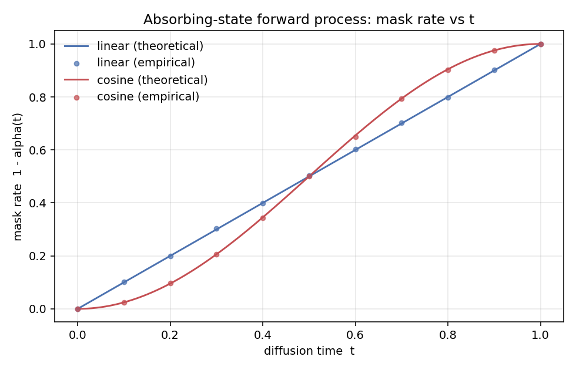

# Aether

[](https://github.com/ameyg910/aether/actions/workflows/ci.yml)
[](https://www.python.org/)
[](LICENSE)
[](https://github.com/astral-sh/ruff)
[](https://mypy-lang.org/)

**Aether is a production-grade platform for a modern masked (absorbing-state) diffusion
language model** — the MDLM/SUBS formulation that LLaDA and Dream scaled to challenge
autoregressive LLMs. This repository grows week by week from a typed research skeleton
into a served, containerized, observable, open-source framework.

> **Status:** Week 4 — the data pipeline, bidirectional DiT denoiser, and SUBS training
> objective are in place, driven by a tracked, checkpointed, resumable training system
> (bf16 AMP, gradient accumulation, cosine+warmup schedule, EMA). A ~55M-parameter model
> trains on WikiText-103 with a public W&B dashboard. Distributed training, serving, and
> deployment land in later weeks (see the roadmap).

## What works today (Weeks 1–4)

- **Typed, config-driven core.** A Hydra structured-config system — fully typed and
  validated against dataclass schemas, with every field overridable from the CLI — drives
  each run. Noise schedules (linear, cosine) and the absorbing-state forward process are
  implemented and unit-tested. *(Week 1)*
- **Data pipeline.** GPT-2 and byte tokenizers, sequence packing, and sharded `uint16`
  memmap datasets with a content fingerprint (`dataset_hash`) for reproducibility. Builds
  WikiText-103 with a single command; a tiny offline corpus is available for tests.
  *(Week 2)*
- **Model + objective.** A bidirectional DiT denoiser with AdaLN-Zero time conditioning,
  and the MDLM/SUBS training loss — verified against `F.cross_entropy` for numerical
  equivalence and checked with `torch.autograd.gradcheck`. A single-batch overfit collapses
  the loss to ~0, confirming the model can fit. *(Week 3)*
- **Training system.** A config-driven `Trainer` with bf16 AMP, gradient accumulation,
  cosine + warmup LR, gradient clipping, and an EMA of the weights used for all sampling.
  Structured logging; pluggable experiment tracking (`jsonl` / `wandb` / `none`, so CI
  stays offline); a run manifest capturing git SHA, dataset hash, seed, and environment;
  and resumable checkpointing bundling `{model, ema, optimizer, scheduler, step, rng}` —
  with a **bit-for-bit resume test** in CI. *(Week 4)*

Every commit is gated by `mypy --strict`, `ruff`, and `pytest` in CI.

## Quickstart

```bash
git clone https://github.com/ameyg910/aether.git
cd aether
python -m venv .venv && source .venv/bin/activate
make install            # editable install + pre-commit hooks
make demo               # watch a sentence get progressively masked
make plot               # write docs/assets/mask_rate_vs_t.png
make config             # print the composed run configuration
make all                # lint + type-check + test
make data-debug         # build a tiny offline dataset (shards + manifest)
```

> For real WikiText-103: `pip install -e ".[data]"` then `make data`.

```bash
python -m aether.train.overfit   # single-batch overfit: loss collapses to ~0
aether-train train=debug data=local_debug   # tiny tracked training run
```

<<<<<<< HEAD
Training is tracked, checkpointed, and resumable -- see [docs/training.md](docs/training.md). Public W&B run: _TODO (link after first A6000 run)._
=======
Training is tracked, checkpointed, and resumable — see the [Training run](#training-run)
section below and [docs/training.md](docs/training.md).
>>>>>>> f3cc128 (fix(train): store RNG state on CPU for cross-device resume)

### The forward process, in one command

```bash
python -m aether.diffusion.forward --sentence "the cat sat on the mat"
```

```
schedule=linear  seed=0
t=0.00 | the cat sat on the mat  (mask 0%)
t=0.25 | the cat ░░░ on the mat  (mask 17%)
t=0.50 | ░░░ cat ░░░ on ░░░ mat  (mask 50%)
t=0.75 | ░░░ ░░░ ░░░ on ░░░ ░░░  (mask 83%)
t=1.00 | ░░░ ░░░ ░░░ ░░░ ░░░ ░░░  (mask 100%)
```



## Training run

A **55.5M-parameter** MDLM (`d_model=384`, `n_layers=6`, `n_heads=6`) trained on
WikiText-103 (GPT-2 tokenizer, 1024-token blocks) with bf16 AMP on a single H100 MIG
slice. The public dashboard shows a monotonically descending loss curve, decoded text
samples logged every 1000 steps, and a live resume-from-checkpoint that continues the
same curve without a discontinuity.

> **Public W&B dashboard:** https://wandb.ai/f20240973-bits-pilani/aether &nbsp;(run `aether-55m-v2`)

At this compute budget the model learns token frequency — common words surface in the
samples — but not yet long-range coherence; a converged language model is a much larger
compute problem. Evaluation metrics and higher-quality samplers arrive in Week 6. See
[docs/training.md](docs/training.md) for how to launch, resume, and read the dashboard,
and [docs/reviews/review-01.md](docs/reviews/review-01.md) for Engineering Review #1
(strengths, weaknesses, technical debt, and the refactors queued before Week 5).

## Why absorbing-state diffusion?

The forward process replaces tokens with an absorbing `[MASK]` state at a rate set by a
noise schedule; the learned reverse process unmasks them. The MDLM result is that the
training objective reduces to a weighted sum of masked-LM cross-entropy losses — stable
and cheap to train. See [ADR-0001](docs/adr/0001-absorbing-state-mdlm.md).

## Repository structure

```
src/aether/
  config/      # typed Hydra structured configs + loader
  diffusion/   # noise schedules, absorbing forward process, SUBS loss, sampler
  data/        # tokenizer, packing, sharding, datamodule
  models/      # bidirectional DiT denoiser (AdaLN time conditioning)
  train/       # config-driven Trainer: AMP, grad-accum, cosine schedule,
               #   EMA, resumable checkpointing, pluggable experiment tracking
  seed.py      # deterministic seeding + RNG state capture
configs/       # composable YAML run configuration (model / data / train / tracking)
scripts/       # demo + visualization entry points
tests/         # unit + invariant tests (incl. bit-for-bit resume)
docs/          # ADRs, data + training guides, engineering reviews
```

## Roadmap

| Week | Focus | Status |
| ---- | ----- | ------ |
| 1  | Typed skeleton, noise schedules, absorbing forward process | ✅ |
| 2  | Data pipeline: tokenizer, packing, sharded memmap datasets | ✅ |
| 3  | Bidirectional DiT denoiser + MDLM/SUBS loss | ✅ |
| 4  | Training system: AMP, EMA, cosine schedule, checkpointing, tracking | ✅ |
| 5  | Distributed training (DDP / FSDP) | ⏳ |
| 6  | Evaluation harness + higher-quality samplers | ⏳ |
| 7  | Serving / inference API | ⏳ |
| 8  | Docker + CI/CD | ⏳ |
| 9  | Kubernetes + observability | ⏳ |
| 10 | Release + Hugging Face | ⏳ |

## Development

Fully typed (`mypy --strict`), linted and formatted with `ruff`, tested with `pytest`,
and configuration-driven via Hydra. See [CONTRIBUTING.md](CONTRIBUTING.md).

## License

Apache-2.0. See [LICENSE](LICENSE).

## Acknowledgements

Builds on ideas from MDLM (Sahoo et al., 2024), D3PM (Austin et al., 2021), and the
broader discrete-diffusion literature.