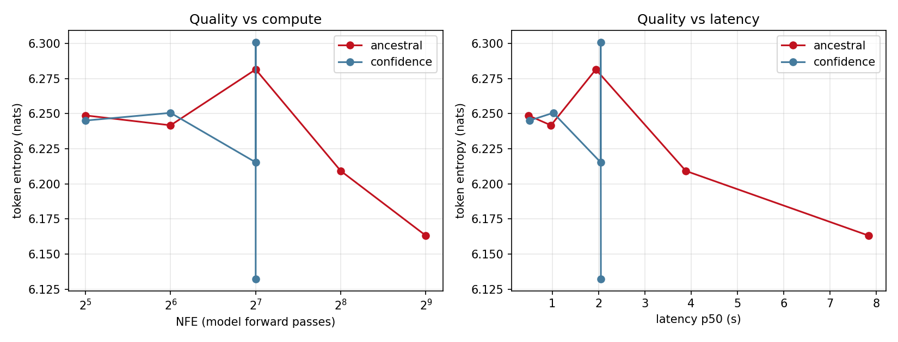

# Aether

[](https://github.com/ameyg910/aether/actions/workflows/ci.yml)
[](https://ameyg910.github.io/aether/)
[](https://github.com/ameyg910/aether/releases)
[](https://huggingface.co/ameyg910/aether-55m)
[](https://www.python.org/)
[](LICENSE)
[](https://github.com/astral-sh/ruff)
[](https://mypy-lang.org/)
[](https://github.com/ameyg910/aether/actions)

**Aether is a production-grade platform for masked (absorbing-state) diffusion language
models** — the MDLM/SUBS formulation that LLaDA and Dream scaled to challenge
autoregressive LLMs.

Built over ten weeks from a typed research skeleton into a **trained, evaluated, served,
containerized, orchestrated, and released framework**. Every layer — from the noise
schedule through to the Kubernetes autoscaler — is implemented, tested, and documented.

> **v1.0.0** · [Docs](https://ameyg910.github.io/aether/) · [Weights](https://huggingface.co/ameyg910/aether-55m) · [Final review](docs/reviews/review-final.md)

---

## The key idea

An autoregressive model generates one token at a time, left to right, spending exactly
one forward pass per token whether the token is trivial or hard. A masked diffusion model
does it differently: it starts from an all-`[MASK]` sequence and unmasks progressively,
with the **number of forward passes (NFE) as a dial you control**.

```bash
python -m aether.diffusion.forward --sentence "the cat sat on the mat"
```

```
t=0.00 | the cat sat on the mat  (mask  0%)
t=0.25 | the cat ░░░ on the mat  (mask 17%)
t=0.50 | ░░░ cat ░░░ on ░░░ mat  (mask 50%)
t=0.75 | ░░░ ░░░ ░░░ on ░░░ ░░░  (mask 83%)
t=1.00 | ░░░ ░░░ ░░░ ░░░ ░░░ ░░░  (mask 100%)
```


*Generation runs this process backwards: the model learns to predict what was masked and
unmasks progressively. The schedule controls how fast tokens disappear going forward; the
sampler controls which ones to reveal first going back.*

---

## Measured results

A 55.5M-parameter model trained on WikiText-103 for 30k steps on one RTX A6000:

| metric | value | notes |
| --- | --- | --- |
| Likelihood bound | **7.14 nats/token** · 10.30 bpd | NELBO upper bound, not exact likelihood |
| Training efficiency | **29.7% MFU** | single A6000, bf16 AMP |
| Serving throughput | **~15 req/s** at 16 concurrent users | p50 660 ms, 0 failures / 471 requests |
| Dynamic batching gain | **~12×** over serialized serving | 8 concurrent → 1 forward pass |
| Confidence sampler | **3.8× faster** at 512 steps | self-limits to 128 NFE regardless |
| Autoscaling | **1 → 5 replicas** under load | verified on k3d, CPU-based HPA |
| CI gate | **182 tests**, 81% coverage | py3.12 + py3.13 matrix |

The model is deliberately small and undertrained — the **platform is the artifact**, and
the model is the fixture that keeps its numbers honest.

---

## NFE quality tradeoff

The confidence-based sampler reveals the positions it is most certain about first — and
**self-limits**, spending only 128 forward passes even when 512 are requested, because it
resolves everything before the budget runs out. That makes it 3.8× faster than ancestral
at comparable quality.



Measured on the 55.5M checkpoint, RTX A6000, ancestral sampler:

| sampler | steps | NFE | p50 (s) | tok/s | distinct-2 | entropy | MAUVE |
| --- | ---: | ---: | ---: | ---: | ---: | ---: | ---: |
| ancestral | 32 | 32 | 0.486 | 4,212 | 0.971 | 6.249 | 0.972 |
| ancestral | 64 | 64 | 0.974 | 2,103 | 0.971 | 6.242 | 0.979 |
| ancestral | 128 | 128 | 1.943 | 1,054 | 0.971 | 6.281 | **0.999** |
| ancestral | 256 | 256 | 3.888 | 527 | 0.954 | 6.209 | 0.989 |
| ancestral | 512 | 512 | 7.838 | 261 | 0.965 | 6.163 | 0.913 |
| confidence | 32 | 32 | 0.511 | 4,005 | 0.971 | 6.245 | 0.976 |
| confidence | 128 | **128** | 2.047 | 1,000 | 0.970 | 6.215 | 0.597 |
| confidence | 512 | **128** | **2.052** | 998 | 0.962 | 6.132 | 0.917 |

MAUVE peaks at 128 steps and declines past that — more compute beyond ~128 steps buys
nothing on this checkpoint. Confidence at 512 requested steps costs the same as 128
actual passes — that is the parallel-decoding argument in one row.

> MAUVE is directional at 16 samples. Entropy and distinct-n are stable.

---

## Platform overview

| week | layer | what is there |
| --- | --- | --- |
| 1 | Config | Hydra structured-config with typed dataclass schemas; every field overridable from CLI |
| 2 | Data | GPT-2 and byte tokenizers, sequence packing, sharded `uint16` memmaps, `dataset_hash` |
| 3 | Model | Bidirectional DiT denoiser, AdaLN-Zero time conditioning, MDLM/SUBS loss |
| 4 | Training | bf16 AMP, gradient accumulation, EMA, resumable checkpoints, bit-for-bit resume test |
| 5 | Distributed | DDP + FSDP behind one flag, world-size-independent checkpoints, MFU reporting |
| 6 | Evaluation | NELBO, MAUVE, diversity, NFE-quality sweep, pinned CI regression benchmark |
| 7 | Serving | FastAPI, dynamic batching (~12×), SSE streaming, versioned registry, Prometheus |
| 8 | Containers | Multi-stage images, `docker compose` stack, CI matrix, GHCR publishing |
| 9 | Kubernetes | Helm chart, queue-depth HPA, dashboards-as-code, `kind` CI job |
| 10 | Release | HF Hub model + card, docs site, v1.0.0 tag, `make train-toy` reproducibility |

Every commit passes `mypy --strict`, `ruff`, and `pytest` across Python 3.12 and 3.13.

---

## Quickstart

```bash
git clone https://github.com/ameyg910/aether.git
cd aether
python -m venv .venv && source .venv/bin/activate
make install          # editable install + pre-commit hooks
make all              # lint + type-check + 182 tests (~30 s)
```

**Reproduce a full training run with no GPU and no downloads:**

```bash
make train-toy
# ==> preparing a small offline corpus
# ==> training (200 steps, tiny model)
# ==> evaluating
# done. checkpoint: runs/toy/checkpoints/latest.pt
#       metrics:    runs/toy/metrics.jsonl
#       eval:       benchmarks/results/toy.json
```

**Verify the objective is correct:**

```bash
python -m aether.train.overfit    # loss collapses to ~0 on one batch
```

**Serve the published model:**

```bash
pip install -e ".[serve]"
aether-serve serve.model_version=hf:ameyg910/aether-55m@v1.0.0

# generate
curl -X POST localhost:8000/generate \
  -H 'content-type: application/json' \
  -d '{"n_samples":2,"length":64,"steps":64,"sampler":"ancestral"}'

# watch tokens resolve live (SSE streaming)
python examples/client_example.py --stream --steps 64

# OpenAPI docs
open http://localhost:8000/docs
```

**Full observability stack in one command:**

```bash
MODEL_VERSION=hf:ameyg910/aether-55m@v1.0.0 docker compose up --build
# server      http://localhost:8000/docs
# prometheus  http://localhost:9090
# grafana     http://localhost:3000  (admin/admin)
```

---

## What works today

- **Typed, config-driven core.** A Hydra structured-config system — fully typed and
  validated against dataclass schemas, with every field overridable from the CLI — drives
  each run. Noise schedules (linear, cosine) and the absorbing-state forward process are
  implemented and unit-tested. *(Week 1)*

- **Data pipeline.** GPT-2 and byte tokenizers, sequence packing, and sharded `uint16`
  memmap datasets with a content fingerprint (`dataset_hash`) for reproducibility. Builds
  WikiText-103 with a single command; a tiny offline corpus is available for tests.
  *(Week 2)*

- **Model + objective.** A bidirectional DiT denoiser with AdaLN-Zero time conditioning,
  and the MDLM/SUBS training loss — verified against `F.cross_entropy` for numerical
  equivalence and checked with `torch.autograd.gradcheck`. A single-batch overfit
  collapses the loss to ~0, confirming the model can fit. *(Week 3)*

- **Training system.** A config-driven `Trainer` with bf16 AMP, gradient accumulation,
  cosine + warmup LR, gradient clipping, and an EMA of the weights used for all sampling.
  Structured logging; pluggable experiment tracking (`jsonl` / `wandb` / `none`, so CI
  stays offline); a run manifest capturing git SHA, dataset hash, seed, and environment;
  and resumable checkpointing bundling `{model, ema, optimizer, scheduler, step, rng}` —
  with a **bit-for-bit resume test** in CI. *(Week 4)*

- **Distributed training.** DDP and FSDP behind a single `train.strategy` flag, with a
  size-based FSDP auto-wrap policy and optional activation checkpointing. Metrics reduce
  across ranks, side effects are rank-0 only, and gradient accumulation suppresses the
  all-reduce on all but the final micro-batch. Checkpoints are consolidated so they are
  **world-size independent** — one written by a 3-GPU run restores into a single process.
  Throughput and MFU are logged, and a scaling experiment turns several runs into a plot.
  *(Week 5)*

- **Evaluation and sampling.** A typed, config-driven harness computing the diffusion
  NELBO (nats/token, bits-per-dim, perplexity) with stratified time sampling, MAUVE via
  the divergence frontier, and diversity metrics (distinct-n, entropy, repetition). Two
  samplers — faithful `ancestral` and confidence-based parallel decoding — both reporting
  NFE, plus a benchmark sweeping the quality-vs-compute curve. *(Week 6)*

- **Inference service.** FastAPI with `/generate`, SSE streaming, `/health`, `/ready`,
  `/metrics`, and admin swap/rollback. An async dynamic batcher merges concurrent
  requests into single forward passes — measured at **~12× throughput** under 16
  concurrent users on one A6000 — and a model registry loads checkpoints by version tag
  from local paths or the HF Hub so deploys are reproducible and rollback is instant.
  *(Week 7)*

- **Reproducible builds and CI/CD.** Multi-stage Docker images for serving and
  training — non-root, with the build toolchain excluded from the runtime layer — plus a
  one-command `docker compose` stack wiring the server to Prometheus and a provisioned
  Grafana dashboard. `uv.lock` pins the full transitive dependency graph. CI runs a
  Python 3.12/3.13 matrix with coverage and builds both images; tagged releases re-run
  the entire gate before publishing versioned images to GHCR. *(Week 8)*

- **Kubernetes orchestration and observability.** A versioned Helm chart with probes,
  resource requests, rolling updates that never dip below full capacity, and an HPA
  scaling on `aether_queue_depth`. Grafana dashboards and alert rules live in the repo
  and are checked in CI against the registry's real metric names, so a renamed series
  fails a build instead of silently emptying a panel. A `kind` job installs the chart on
  a real cluster and probes the endpoints. *(Week 9)*

- **Release: model on HF Hub, docs site, v1.0.0.** The trained checkpoint and a
  generated model card (numbers pulled from the eval report, cannot drift) are published
  at [ameyg910/aether-55m](https://huggingface.co/ameyg910/aether-55m). A MkDocs
  Material site builds with `--strict` (broken links fail the build) and deploys to
  GitHub Pages. `make train-toy` reproduces a full train-and-evaluate cycle from a clean
  clone with no GPU. *(Week 10)*

Every commit is gated by `mypy --strict`, `ruff`, and `pytest` in CI — including a
multi-process DDP test that spawns real workers and asserts that ranks trained on
different data end with identical parameters, and a pinned regression benchmark anchored
to `ln(vocab-1)` — an *external*, analytically-known bound — that fails the build when
quality or performance silently drifts.

---

## Training

A 55.5M-parameter MDLM (`d_model=384`, `n_layers=6`, `n_heads=6`) on WikiText-103
(GPT-2 tokenizer, 1024-token blocks), bf16 AMP, single RTX A6000.

> **W&B dashboard:** https://wandb.ai/f20240973-bits-pilani/aether

```bash
# real training run
aether-train model=medium data=wikitext103 train.out_dir=runs/my-run

# multi-GPU DDP (torchrun)
NPROC=3 scripts/launch/torchrun_local.sh

# SLURM FSDP
sbatch scripts/launch/slurm_fsdp.sbatch
```

Key design decisions:

- **Checkpoints are world-size independent.** A checkpoint written by a 3-GPU DDP run
  restores cleanly into a single process and vice versa.
- **Checkpoint pruning is scoped to the current run.** An early bug pruned by globbing
  the directory and deleting the lowest-numbered file — which was the *newest* checkpoint
  in a run starting where older runs had left higher-numbered files. Fixed: pruning is
  now scoped to files the current run wrote. This is the bug that destroyed real
  checkpoints before the fix.
- **MFU is reported per-step.** 29.7% on one A6000. The flop estimate uses
  `6N + 12 · n_layers · d_model · seq_len` per token.
- **EMA weights are used for all sampling.** The trainer maintains an exponential moving
  average and passes those weights to evaluation and serving.
- **Every run writes a manifest.** Git SHA, dataset hash, seed, and full resolved config
  are recorded at run start so any result is reproducible from the manifest alone.
- **Checkpoints carry their architecture.** Head count leaves no trace in any parameter
  shape (attention reshapes into heads inside the forward pass), so a checkpoint without
  it can be loaded into a differently-shaped model that silently computes something else.
  The trainer records the full config at save time.

See [docs/training.md](docs/training.md) for the full guide.

---

## Serving

```bash
aether-serve serve.model_version=hf:ameyg910/aether-55m@v1.0.0 \
  serve.max_batch_size=64 serve.max_wait_ms=20
```

**Load test results — 16 concurrent users, 60 s, single RTX A6000:**

| metric | value |
| --- | ---: |
| throughput (`/generate`) | ~15 req/s |
| aggregate throughput | ~17 req/s |
| latency p50 | ~660 ms |
| latency max | 1,208 ms |
| failures | 0 / 471 |
| `/health` under full load | **4 ms** |

One request takes 771 ms alone. Under 16 concurrent users the measured 15 req/s is
**~12× faster** than serialized serving, with p50 *below* the single-request latency —
because a request arriving mid-batch rides along at no extra cost.

`/health` stays at 4 ms while the GPU is saturated — the blocking model call runs in a
worker thread via `asyncio.to_thread`, so the event loop never stalls and liveness probes
keep answering. That is the practical reason these are two separate probes: failing
liveness restarts the container; failing readiness only removes it from the load balancer.
A pod still loading weights must fail readiness and *pass* liveness, or it is killed
before it can finish loading — forever.

**SSE streaming — watch text denoise live:**

```
event: step
data: {"step":1,"total_steps":32,"n_masked":60,"nfe":1,"text":" acted \" haria"}

event: step
data: {"step":4,"total_steps":32,"n_masked":54,"nfe":4,
       "text":" acted Lysar which but included \" in haria"}

event: done
data: {"latency_ms":2050.4,"model_version":"hf:ameyg910/aether-55m@v1.0.0"}
```

`n_masked` counts down as positions resolve. This is the diffusion process made visible —
something autoregressive models cannot show.

**Versioned model loading and rollback:**

```bash
# load a new checkpoint without redeploying
curl -X POST localhost:8000/admin/swap \
  -H 'content-type: application/json' \
  -d '{"version":"hf:ameyg910/aether-55m@v1.0.0"}'

# instant rollback — the previous version is already in memory
curl -X POST localhost:8000/admin/rollback
```

Swapping is atomic: the new model is fully constructed before the live pointer moves,
so a bad version tag returns 400 and leaves the running service untouched. The previous
version stays in memory, so rollback cannot itself fail by re-downloading — which matters
because you roll back when things are already going wrong.

See [docs/serving-demo.md](docs/serving-demo.md) for the full verified terminal
transcript and [docs/serving.md](docs/serving.md) for the reference guide.

---

## Kubernetes

```bash
k3d cluster create aether --agents 2
helm install aether ./deploy/helm/aether \
  --set model.version=hf:ameyg910/aether-55m@v1.0.0

kubectl port-forward svc/aether 8000:8000
curl localhost:8000/ready
```

**The autoscaler scales on queue depth, not CPU.** Once the worker-thread pool is busy,
CPU flattens near a ceiling while requests pile up — so it saturates *before* it reflects
how far behind the service is. On GPU it barely moves at all. Queue depth measures what
users actually feel and responds immediately in both directions.

Autoscaling under load — verified on k3d:

```
NAME     TARGETS         REPLICAS   AGE
aether   cpu:  1%/70%   1          2m
aether   cpu: 198%/70%  3          5m   ← load spike
aether   cpu: 321%/70%  4          5m
aether   cpu: 292%/70%  5          5m   ← maxReplicas hit
```

Scale-up is fast (30s stabilization, up to doubling); scale-down is slow (300s, one pod
at a time). The asymmetry is deliberate: an extra pod is cheap, but scaling down into a
trough that immediately returns means every new pod pays a cold model load again.

**Dashboards and alert rules are code, not clicks:**

```bash
# CI validates every query against the real metric names
pytest tests/deploy::test_dashboard_queries_only_reference_real_metrics
# a renamed metric fails the build instead of silently emptying a panel
```

See [docs/deployment.md](docs/deployment.md) for the clean-cluster install guide,
[docs/runbook.md](docs/runbook.md) for operational procedures, and
[docs/architecture.md](docs/architecture.md) for the full system diagram with Mermaid.

---

## Containers and CI/CD

**Image design:**

- **Multi-stage** — build stage carries compilers and pip; runtime stage receives only
  the virtualenv. Build toolchain never reaches the published layer.
- **`python:3.12-slim` base, not `nvidia/cuda`** — PyTorch CUDA wheels vendor the
  runtime libraries. Host only needs the driver. Skips ~2 GB of duplicated libraries.
- **Non-root uid 10001** — a container escape from a root process is a host compromise.
- **`readOnlyRootFilesystem: true`** — anything that writes needs an explicit volume
  mount, making the attack surface explicit.

**Release pipeline:**

```bash
git tag -a v1.0.0 -m "v1.0.0" && git push origin v1.0.0
```

The release workflow re-runs the full gate before publishing. Tags can be pushed to any
commit, including one CI never saw — publishing without re-verifying would let an
untested artifact into the registry. See [docs/releasing.md](docs/releasing.md).

---

## Why absorbing-state diffusion?

The forward process replaces tokens with an absorbing `[MASK]` state at a rate set by a
noise schedule; the learned reverse process unmasks them. The MDLM result (Sahoo et al.,
2024) is that the training objective reduces to a weighted sum of masked-LM
cross-entropy losses — the same loss used to pretrain BERT, stable and cheap to train.

Three properties that matter for a serving platform:

1. **The objective is exact.** No score-matching approximation, no variational gap beyond
   the Monte Carlo estimator used for evaluation.
2. **Generation cost is controllable.** NFE is a parameter, not a consequence of sequence
   length. A 64-token sequence can be generated in 8 forward passes or 512.
3. **The architecture is natively an infiller.** Pin some positions to real tokens and the
   model fills the rest bidirectionally — something an AR model cannot do. This release is
   unconditional; infilling is the first roadmap item.

See [ADR-0001](docs/adr/0001-absorbing-state-mdlm.md) for the full design decision.

---

## Repository structure

```
src/aether/
  config/      # typed Hydra structured configs + loader (AETHER_CONFIG_DIR aware)
  diffusion/   # noise schedules, forward process, SUBS loss, samplers (NFE-aware)
  evaluate/    # NELBO/bpd, MAUVE, diversity metrics + `aether-eval` CLI
  serve/       # FastAPI, dynamic batcher, model registry, Prometheus metrics
  data/        # tokenizer, packing, sharding, datamodule
  models/      # bidirectional DiT denoiser + checkpoint geometry recovery
  train/       # Trainer: AMP, grad-accum, EMA, DDP/FSDP, MFU, checkpointing
  seed.py      # deterministic seeding + RNG state capture

configs/       # composable YAML (model / data / train / tracking / eval / serve)
benchmarks/    # NFE-quality sweep + pinned regression benchmark
loadtest/      # locust load-test driver (proven ~15 req/s on A6000)
docker/        # multi-stage Dockerfiles + Prometheus/Grafana provisioning
deploy/
  k8s/         # plain Kubernetes manifests (Deployment, Service, HPA, loadgen)
  helm/aether/ # versioned Helm chart (v0.9.0, 9 templates)
  grafana/     # 10-panel dashboard JSON + 5 Prometheus alert rules
  prometheus/  # prometheus-adapter values for queue-depth autoscaling
scripts/
  publish_hf.py      # publish checkpoint + generated model card to HF Hub
  launch/            # torchrun (local) + SLURM sbatch templates
examples/
  client_example.py  # batch generation + SSE streaming client
demo/          # Gradio Space source
tests/         # 182 tests: unit, invariant, DDP, serve, deploy
docs/          # MkDocs site: ADRs, guides, reviews, runbook, architecture diagram
```

---

## Roadmap

| week | focus | status |
| ---- | ----- | ------ |
| 1 | Typed skeleton, noise schedules, absorbing forward process | ✅ |
| 2 | Data pipeline: tokenizer, packing, sharded memmap datasets | ✅ |
| 3 | Bidirectional DiT denoiser + MDLM/SUBS loss | ✅ |
| 4 | Training system: AMP, EMA, cosine schedule, checkpointing, tracking | ✅ |
| 5 | Distributed training (DDP / FSDP), MFU + scaling | ✅ |
| 6 | Evaluation harness, samplers, NFE benchmark | ✅ |
| 7 | Serving: batching, registry, SSE, metrics | ✅ |
| 8 | Docker, compose stack, CI/CD, release policy | ✅ |
| 9 | Kubernetes, Helm, autoscaling, dashboards | ✅ |
| 10 | Release: HF Hub model + card, docs site, v1.0.0 | ✅ |

**Next** (see [ROADMAP.md](ROADMAP.md)):

- **Prompt-conditioned infilling** — ~15-line change to `iter_denoise`; the single
  biggest gap between the demo and what the architecture is actually for
- **KV-cache reuse** via block/semi-autoregressive decoding
- **int8 weight-only quantization** + `torch.compile`
- **Multi-node training** — FSDP is implemented but has never run on real hardware

---

## Development

```bash
make install    # editable install + pre-commit (ruff, mypy, pytest)
make all        # full gate: lint + format + type-check + 182 tests
make train-toy  # end-to-end train + eval, no GPU, no downloads
make docs       # build the MkDocs site locally
make docs-serve # live-reload docs server at localhost:8000
```

Fully typed (`mypy --strict`, zero errors across 43 source files), linted with `ruff`,
formatted with `ruff format`, tested with `pytest` (182 tests, 81% coverage), and
configuration-driven with Hydra.

The test suite includes:

- A **multi-process DDP test** that spawns real workers, trains on different data, and
  asserts ranks end with identical parameters.
- A **bit-for-bit resume test** that saves a checkpoint, restores it, and asserts the
  loss on the next step is numerically identical.
- A **pinned regression benchmark** anchored to `ln(vocab-1)` — an external, analytically
  known bound for an untrained model — that gates every CI build.
- **23 deploy tests** validating dashboard queries, Helm values paths, probe wiring, and
  alert rule links against the metrics the service actually exports. A renamed series
  fails the build.

Looking to contribute? [ROADMAP.md](ROADMAP.md) lists open work including several
`good first issue` items that need no GPU.

---

## Honest limitations

Stated plainly, because a portfolio project that only lists wins is not worth trusting:

- **The model is unconditional.** No prompt input — generates from all-`[MASK]`. The
  architecture is natively an infiller; this release does not implement it. It is the
  first roadmap item.
- **FSDP has never run on hardware.** Cannot initialize on CPU, so no CI coverage, and
  no multi-GPU box was available during development. Code-reviewed, not tested.
  ([ADR-0003](docs/adr/0003-ddp-vs-fsdp.md))
- **No GPU in CI.** bf16 kernels and NCCL collectives are exercised by hand only.
- **The scaling plot is missing.** DDP correctness is covered by a multi-process CI test;
  three GPUs were never simultaneously free to measure efficiency.
- **Four bugs shipped because the sandbox differed from the target.** The batcher's
  `TimeoutError` on Python 3.10; the config path once installed into site-packages;
  `--help` through Hydra; the loadgen's wrong Service name. Each was invisible where
  written and obvious where run. See [docs/reviews/review-final.md](docs/reviews/review-final.md).

---

## License

Apache-2.0. See [LICENSE](LICENSE).

## Citation

```bibtex
@software{aether,
  author = {Gupta, Amey},
  title  = {Aether: a production platform for masked diffusion language models},
  year   = {2026},
  url    = {https://github.com/ameyg910/aether}
}
```

See [CITATION.cff](CITATION.cff) for the full citation file.

## Acknowledgements

Builds on ideas from MDLM (Sahoo et al., 2024), D3PM (Austin et al., 2021), and the
broader discrete-diffusion literature. The SUBS/absorbing-state formulation is from the
MDLM paper; the bidirectional DiT architecture follows the D3PM family with AdaLN-Zero
time conditioning from DiT (Peebles & Xie, 2023).