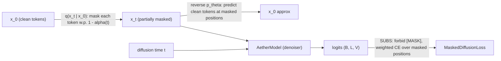
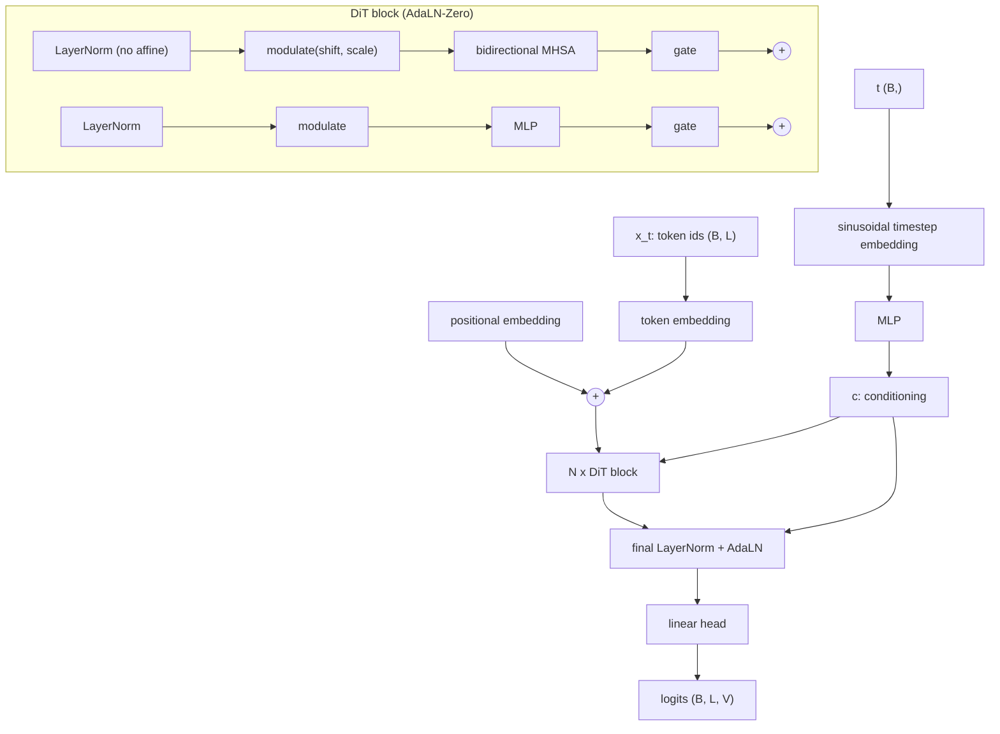

# Architecture

Aether is a masked (absorbing-state) diffusion language model. The **forward
process** progressively replaces tokens with an absorbing `[MASK]` state; the
learned **reverse process** (the model) unmasks them. Training reduces to a
weighted sum of masked-language-modeling cross-entropy losses (MDLM / SUBS).

## Forward / reverse process

## Model (bidirectional, time-conditioned)

## Key design points

- **Bidirectional attention** (no causal mask): the denoiser conditions on the
  entire partially-masked sequence, unlike an autoregressive LM.
- **AdaLN-Zero time conditioning** (DiT-style): the timestep embedding produces
  per-block shift/scale/gate; the modulation MLPs are zero-initialized so the
  network starts as a stable residual identity. See
  [ADR-0002](adr/0002-time-conditioning.md).
- **SUBS parameterization** (in the loss, not the model): `[MASK]` is forbidden in
  the output (zero-masking) and unmasked positions carry over (contribute zero
  loss), so only masked positions are supervised.
- **Numerically delicate weight** `w(t) = -alpha'(t) / (1 - alpha(t))` diverges as
  `t -> 0`; time is sampled from `[t_min, 1]` to keep it finite.
