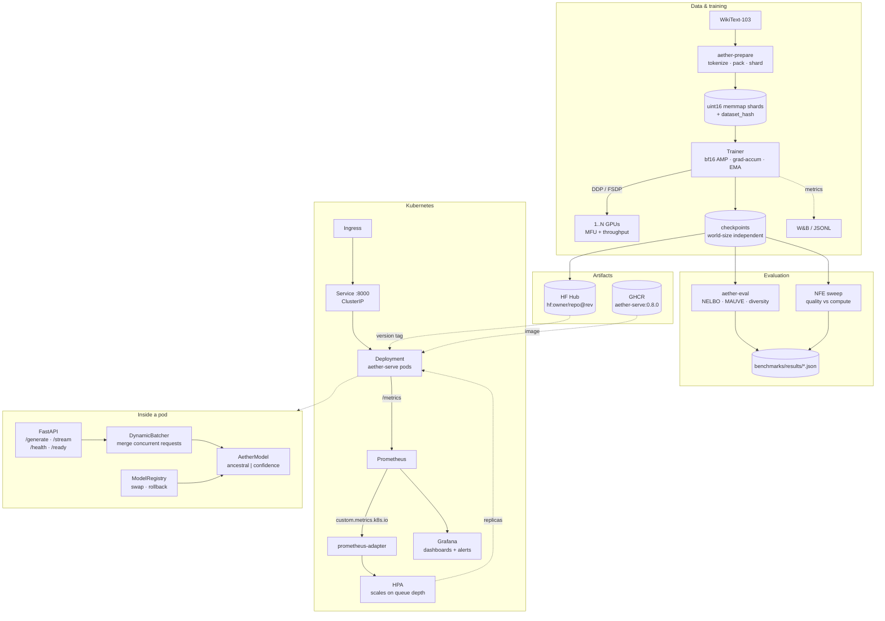

# Architecture



## Request path

1. **Ingress → Service → pod.** The Service load-balances across whatever replicas
   currently exist; the HPA changes that set without the address changing.
2. **FastAPI validates** the request against a pydantic schema — an out-of-range
   `steps` is rejected with a 422 before it can become an out-of-memory error.
3. **The batcher holds it** for up to `max_wait_ms`, merging it with any
   concurrent requests carrying identical generation parameters.
4. **The model runs once** for the whole batch, in a worker thread so the event
   loop stays free to serve `/health` and accept new connections.
5. **Results are sliced** back to individual callers and decoded to text.

Streaming (`/generate/stream`) deliberately bypasses the batcher: an SSE
connection owns a generator for its lifetime, and interleaving several into shared
batch steps would let the slowest client dictate everyone's frame rate.

## Scaling path

```
load ↑ → queue depth ↑ → prometheus-adapter → HPA → replicas ↑ → queue depth ↓
```

The loop closes on `aether_queue_depth` rather than CPU, because CPU flattens near
a ceiling once the worker pool is busy and cannot distinguish "comfortably busy"
from "drowning". See [deployment.md](deployment.md#autoscaling).

## Why the boundaries sit where they do

- **Registry separate from the app.** Weights are identified by version tag, not
  path, so a rollback is a pointer swap rather than a redeploy — and the previous
  version stays in memory, so it cannot fail by re-downloading at the exact moment
  things are going wrong.
- **Batcher separate from the endpoint.** The endpoint knows about HTTP; the
  batcher knows about GPU efficiency. Replacing fixed-window batching with
  continuous batching should not touch the API layer.
- **Metrics defined in one place**, derived from the Prometheus registry, so
  dashboards and alert rules can be validated against what the service actually
  exports rather than against what someone remembers it exporting.
